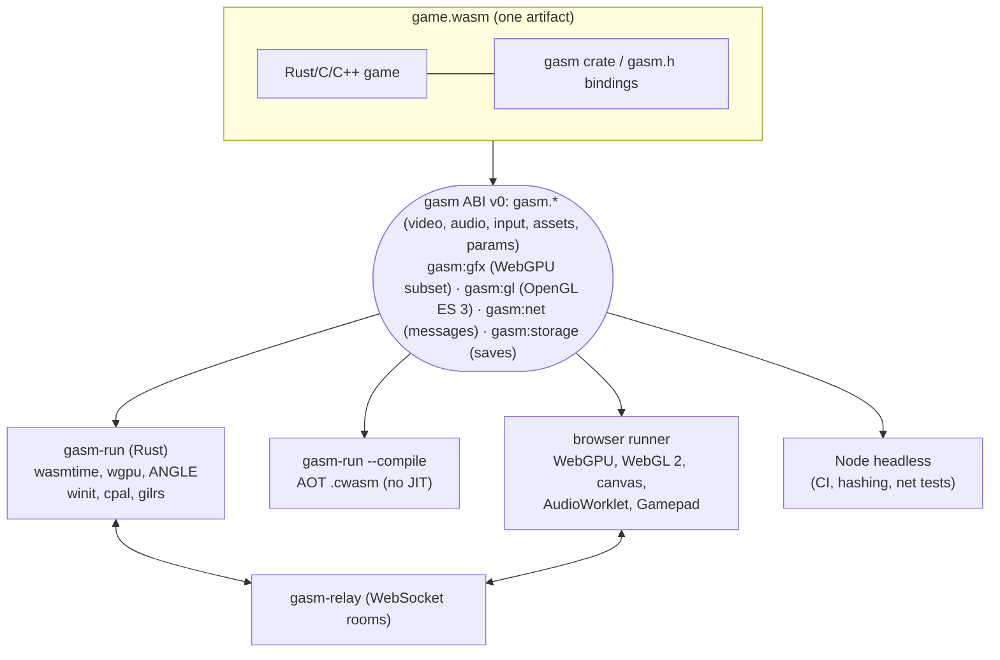

# gasm — game assembly

A proof of concept for a portable game runtime: **games are compiled once to
WebAssembly, and thin per-platform *runners* expose a small, stable binary
interface** (video, audio, input, assets, GPU, network). The same `.wasm` runs
natively (wasmtime + wgpu), in the browser (WebAssembly + WebGPU), and headless
in Node, with bit-identical game state.

Games in this repo (Rust, C and C++):

| Game | Shows | Size |
|---|---|---|
| `sumo.wasm` | 3D (`gasm:gfx`, WebGPU/WGSL) + online 2-player lockstep (`gasm:net`), with cross-play between native and browser | 57 KB |
| `nes.wasm` | NES emulator on [tetanes-core](https://crates.io/crates/tetanes-core): 2D video, audio, input, assets | 1.3 MB |
| `scummvm.wasm` | [ScummVM](https://www.scummvm.org/) with a gasm backend (Asyncify inside the guest, or `scummvm-run.wasm` for runners that switch stacks): the LucasArts SCUMM games (Monkey Island, Day of the Tentacle, Sam & Max, Full Throttle, ...), Humongous games, the freeware Beneath a Steel Sky and Drascula, MP3/Ogg Vorbis/FLAC audio, saves in `gasm:storage` ([guests/scummvm](guests/scummvm/README.md), with its porting status) | 16.1 MB |
| `doom.wasm` | DOOM ([doomgeneric](https://github.com/ozkl/doomgeneric), C) with OPL music, saves in `gasm:storage`, any IWAD as an asset ([guests/doom](guests/doom/README.md)) | 656 KB |
| `sdl3-snake.wasm`, `sdl3-woodeneye.wasm` | SDL 3's own demos, source unchanged, on [SDL 3 for gasm](sdk/sdl3/README.md) (SDL as a private platform: video, input, audio, gamepads, files) | 817 KB |
| `triangle.wasm` | Smallest `gasm:gfx` program (about 50 lines of Rust) | 17 KB |
| `inputtest.wasm` | Shows every raw input: keyboard (with modifiers), mouse, gamepads and joysticks | 61 KB |
| `textured.wasm` | Textures with mipmaps, two samplers, explicit layouts, dynamic offsets, a storage buffer, 4:3 viewport and text input | 43 KB |
| `test-pattern.wasm` | Minimal C guest (proves the ABI is language-agnostic) | 76 KB |
| `assetcheck.wasm` | Test guest for asset providers (folders, streaming, OPFS) | 27 KB |



**Website:** [gasm.emdzej.pl](https://gasm.emdzej.pl): docs and **playable demos** in your browser.
**Docs:** [user guide](site/guide/index.md) · [how it works](site/docs/how-it-works.md) ·
[writing games](site/dev/games.md) · [writing runners](site/dev/runners.md) ·
[testing](site/dev/testing.md) · [ABI spec](spec/ABI.md) · [roadmap](site/docs/roadmap.md)

## Packages

| For | Package |
|---|---|
| Writing games in Rust | [`gasm-sdk`](https://crates.io/crates/gasm-sdk) on crates.io |
| Writing games in C/C++ | `gasm-c-sdk-<version>.zip` on Releases (`gasm.h` + CMake toolchain) |
| Embedding in a web page / Node | [`@emdzej/gasm-host`](https://www.npmjs.com/package/@emdzej/gasm-host) on npm |
| Embedding natively / `cargo install` | [`gasm-host`](https://crates.io/crates/gasm-host) on crates.io (library + `gasm-run`) |
| Hosting a relay | `ghcr.io/emdzej/gasm-relay`, or `gasm-relay` from the release bundles |

The ABI itself is machine-readable ([`spec/abi.json`](spec/abi.json)); the C header
and Rust bindings are generated from it. See [Packages](site/dev/packages.md).

## Download

[Releases](https://github.com/emdzej/gasm/releases) have ready-to-run builds:
**macOS apps** (Sumo.app, NES.app, Triangle.app, Test Pattern.app; unsigned, so
right-click → Open the first time) and `gasm-run` + `gasm-relay` + games for macOS
(universal), Linux (x86_64, arm64) and Windows. Also there: the games alone (with
their license notices, `THIRD-PARTY.txt`), the complete source of `doom.wasm` and
`scummvm.wasm`, the C/C++ SDK and SDL 3 for gasm (`gasm-sdl3-<version>.zip`).
Or just [play in the browser](https://gasm.emdzej.pl/demos/).

## Quick start

Requirements (building from source): Rust via **rustup** (Homebrew's rust has no wasm targets; the
Makefile adds `wasm32-unknown-unknown` to the `stable` toolchain), Node ≥ 22,
Python 3 (dev web server), curl, git. `make` fetches
[wasi-sdk](https://github.com/WebAssembly/wasi-sdk) into `tools/` on first use.
It builds the C example and provides `wasm-ld`, which links the Rust games.
On Linux, the native runner also needs `libasound2-dev libudev-dev pkg-config`.

```sh
make                 # build games (build/*.wasm) + native runner + relay
make roms            # fetch freely distributable test ROMs / homebrew, Freedoom and shareware DOOM into roms/
make test            # determinism (JIT vs AOT vs V8) + network lockstep tests

R=runners/native/target/release/gasm-run

# 3D sumo vs. a bot
$R build/sumo.wasm

# 3D sumo online: start a relay, then two players (any mix of native/browser)
make relay                                                     # terminal 1
$R build/sumo.wasm --allow-net --param relay=ws://127.0.0.1:9000   # terminal 2
make web   # terminal 3, open http://localhost:8080/runners/web/, enter the relay URL, start

# NES
$R build/nes.wasm --rom roms/bladebuster.nes

# DOOM (any IWAD: doom1.wad, doom2.wad, Freedoom, ...)
$R build/doom.wasm --asset wad=roms/doom1.wad

# ScummVM (Beneath a Steel Sky, freeware; or --asset-dir <your game> --param "args=--auto-detect -p /")
$R build/scummvm.wasm --asset-dir roms/bass --param "args=-p / sky"
```

Controls: arrows = D-pad, **X** = A, **Z** = B, **Enter** = Start,
**Right Shift** = Select (plus S/A = X/Y, Q/W = L/R). Gamepads work in both
runners. Games can also read the keyboard, mouse and gamepads directly (DOOM
does). Hold **Esc** to quit. In sumo: move with the D-pad, **dash with A or B**, and push the other
ball off the platform. First to 5 wins.

## Results (Apple M1 Pro, this commit)

**Portability.** `make test` checks 25 single-player cases (test pattern, the
textured GPU test, the input tester, games with their own main loop in Rust and C,
four SDL 3 programs (snake, woodeneye, callbacks with audio, a classic main loop),
DOOM on keyboard and mouse, ScummVM
playing, saving and loading Beneath a Steel Sky, the Day of the Tentacle demo, Drascula with Ogg, MP3 and FLAC music, sumo vs. bot, 5 NES test ROMs/demos, scripted Blade Buster gameplay, the DOOM and
Freedoom attract-mode demos, and a scripted DOOM game that saves and loads). Each produces
**bit-identical video, audio and GPU-upload streams** on wasmtime JIT,
wasmtime AOT and V8, equal to golden hashes (`tests/golden/determinism.txt`) that CI
checks on Linux (x86_64, arm64), macOS and Windows. It also plays 3,600-frame online sumo matches through
`gasm-relay` for native↔native, native↔Node and Node↔native, all ending in the
identical game state. A headless-Chrome (WebGPU) player against a native
player was also verified (`fa43844c` on both sides after 1,200 frames).

**NES correctness** (tetanes-core, inside wasm): blargg `instr_test-v5` *All
16 tests passed*, `cpu_timing_test6` *PASSED*, `apu_test` *All 8 tests
passed*. `make parity` builds the same Rust game natively and gets identical
hashes.

**Performance.** 6,000 frames of Blade Buster, emulation only (`--no-hash`):

| build                          | time   | vs native | realtime |
|--------------------------------|--------|-----------|----------|
| native Rust (release, LTO)     | 7.1 s  | 1.0×      | ~14×     |
| wasm, wasmtime (Cranelift AOT) | 10.8 s | 1.5×      | ~9×      |
| wasm, Node 22 (V8)             | 11.2 s | 1.6×      | ~9×      |

Sumo's simulation plus scene building runs at more than 100,000 frames/s
headless; with the GPU, both runners hold 60 fps. DOOM (shareware demos,
`--no-hash`) runs at 2,700 to 3,000 frames/s on wasmtime (JIT and AOT) and about 2,800 on V8, about
80x its 35 Hz.

## Layout

```
spec/abi.json                the ABI, machine-readable: source of truth (gen-abi.mjs makes gasm.h, sys.rs)
spec/ABI.md, spec/gasm.h     the normative doc + the generated C header
guests/                      Rust workspace (wasm32-unknown-unknown)
  gasm/                        Rust bindings + game! macro + native stub host
  sumo/                        3D 2-player game: sim.rs (deterministic), render.rs, lib.rs (lockstep)
  nes/                         NES emulator on tetanes-core
  doom/                        DOOM: gasm platform layer for doomgeneric (engine fetched at build)
  scummvm/                     ScummVM: gasm backend + configure patch (engine fetched at build)
  triangle/                    smallest GPU example
  textured/                    textures, samplers, explicit layouts, dynamic offsets
  inputtest/                   raw keyboard, pointer, gamepads (input tester)
  loopdemo/                    a game with its own main loop (gasm::main_loop: Asyncify or stack switching)
  assetcheck/                  test guest for asset providers
  parity/                      runs the NES game natively (parity + benchmarks)
  test-pattern/                C guest (wasi-sdk)
sdk/c/                       C/C++ SDK: CMake toolchain, gasm_loop (own main loop), gasm_vfile (FILE*), examples
sdk/sdl3/                    SDL 3 for gasm: config + drivers (SDL fetched at build, unpatched)
runners/native/              crate gasm-host: library (headless and windowed runners) + gasm-run;
                             wasmtime, wgpu, winit, cpal, gilrs, tungstenite; own WASI subset (src/wasi.rs)
  relay/                       crate gasm-relay: WebSocket room relay
runners/web/                 @emdzej/gasm-host: gasm-host.js + lib/ (host, WASI, gfx model, assets, input,
                             net, storage), webgpu-gfx.js, gasm-present.js (2D filters), gasm-worker.js, headless.mjs;
                             the player (index.html, app.js)
tests/golden/                golden hashes for the determinism suite
scripts/                     toolchain/ROM fetchers (SHA-256 pinned), test suites, packaging, site build
site/                        website (VitePress): docs, dev guides, demos → gasm.emdzej.pl
.github/workflows/           CI (tests on Linux, macOS, Windows), Pages (site), Release (bundles + packages)
CHANGELOG.md                 what each release added
```

## Licensing

- gasm (spec, runners, relay, bindings, games): MIT.
- `nes.wasm` statically contains tetanes-core (MIT OR Apache-2.0).
- SDL 3 (`sdk/sdl3`, `sdl3-*.wasm`) is zlib-licensed; gasm's drivers for it are zlib too.
- `scummvm.wasm` is **GPL-3.0** as a whole (ScummVM). The repo holds gasm's MIT
  backend and a small `configure` patch; releases and the website ship the
  complete source (the files the build uses) next to the binary.
- `doom.wasm` is **GPL-2.0** as a whole (the DOOM source code). The repo holds
  only gasm's MIT glue and a small engine patch; `make doom` fetches the engine.
  Releases and the website ship the complete source next to the binary.
- ROMs and WADs are not part of the repo. `make roms` downloads test ROMs and homebrew
  demos from the [nes-test-roms](https://github.com/christopherpow/nes-test-roms)
  collection, [Freedoom](https://freedoom.github.io/) (BSD-3-Clause) and the
  freely distributable DOOM shareware `doom1.wad`, and Beneath a Steel Sky (freeware, Revolution Software).

## Next steps

Everything planned or missing is on the
[roadmap](site/docs/roadmap.md): threads ([design](design/threads.md)),
`gasm:gl` ([design](design/gasm-gl.md)), render targets, rollback netplay,
packages. Implemented designs stay in `design/` as a record
([presentation](design/presentation.md), [stack switching](design/stack-switching.md)).
