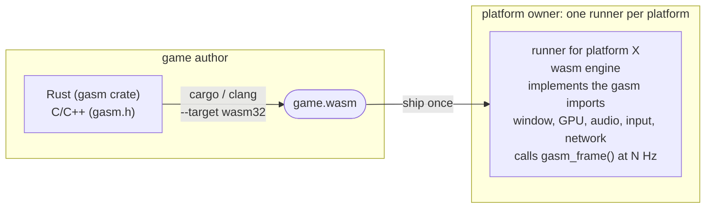
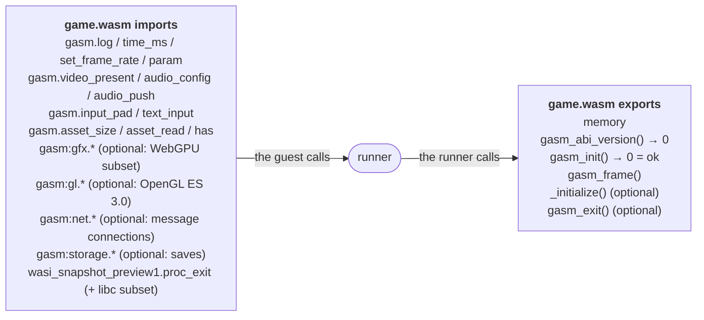
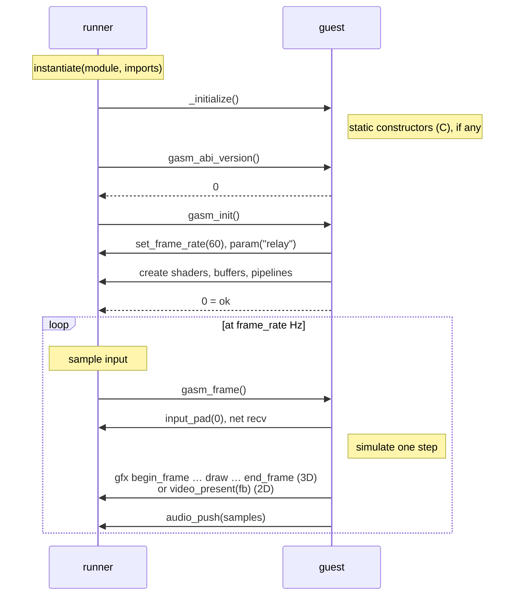
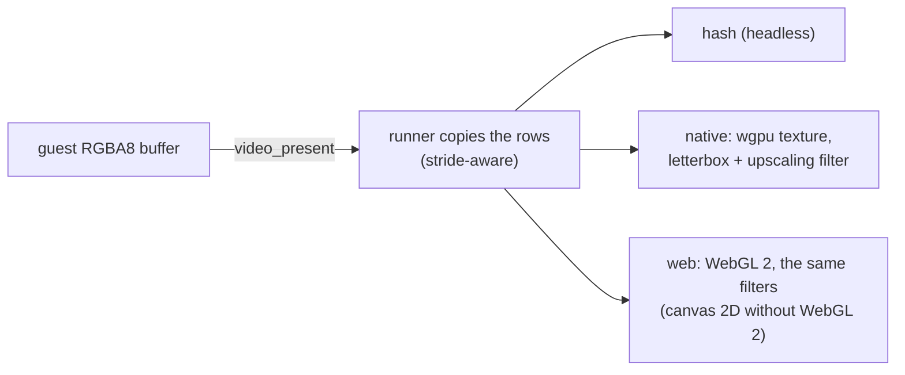
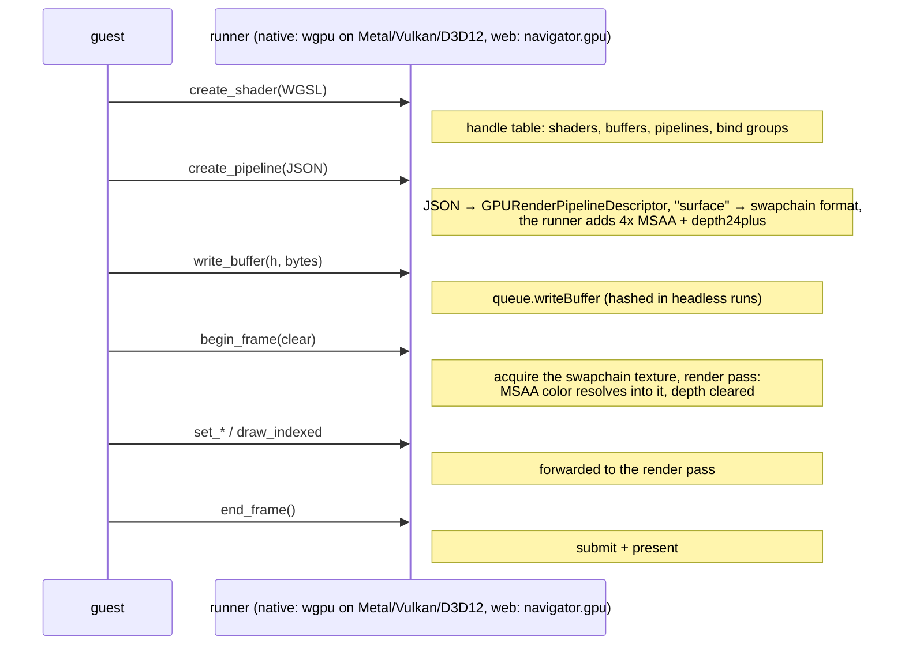
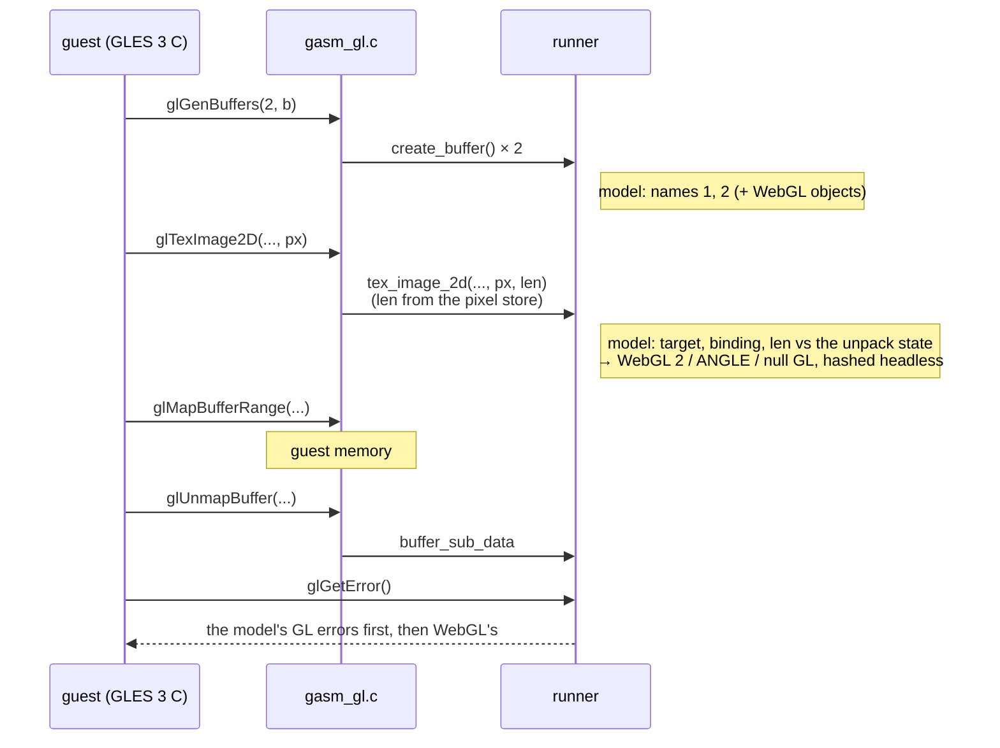
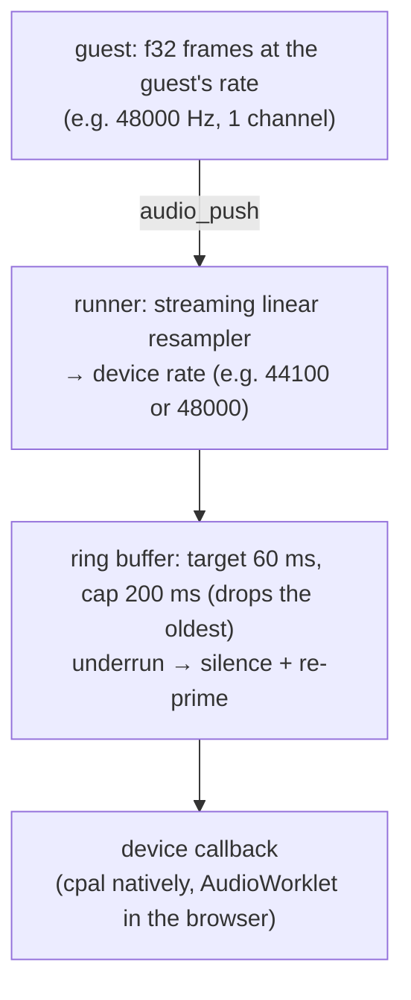
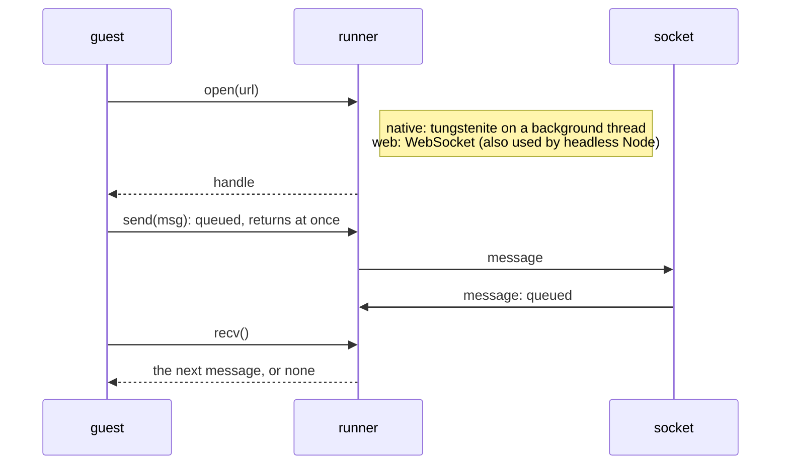
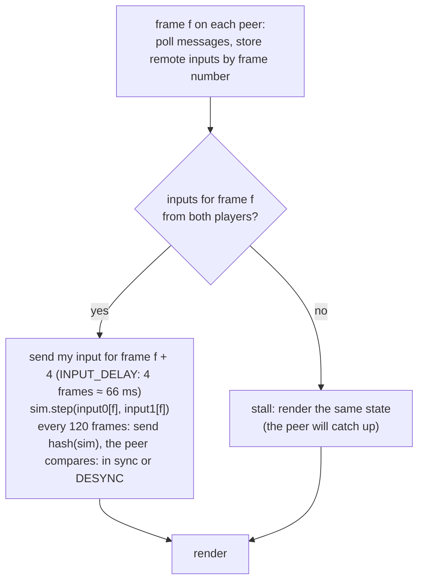

# How gasm works

This document explains the moving parts and why they are shaped the way they
are. For the normative interface, see the [ABI spec](/docs/abi).

## The idea in one picture



A **guest** (game) is a single WebAssembly module. A **runner** (host) is a
native or web program that loads the module, provides the functions the guest
imports, and drives it frame by frame. The **ABI** is the contract between them.
Its core is small (23 imports, 3 exports), and GPU, network and storage are
optional modules on top.

## Components in this repository

| Component | Path | Role |
|---|---|---|
| ABI | `spec/abi.json`, `spec/ABI.md`, `spec/gasm.h` | Import/export contract, v0 (`abi.json` is the source; `gasm.h` is generated) |
| gasm-sdk crate | `guests/gasm/` | Rust bindings (library `gasm`), `game!` macro, native stub host |
| sumo | `guests/sumo/` | 3D two-player game: deterministic sim, WebGPU rendering, lockstep netcode |
| nes | `guests/nes/` | NES emulator on tetanes-core |
| test-pattern | `guests/test-pattern/` | Minimal C guest |
| gasm-run | `runners/native/` | Native runner (crate `gasm-host`, library + binary): wasmtime, wgpu, winit, cpal, gilrs, tungstenite, its own WASI subset |
| gasm-relay | `runners/native/relay/` | WebSocket room relay for online play |
| gasm-host.js | `runners/web/gasm-host.js`, `runners/web/lib/` | JS runner core, shared by browser and Node |
| webgpu-gfx.js | `runners/web/webgpu-gfx.js` | `gasm:gfx` on the browser's WebGPU |
| lib/gl.js | `runners/web/lib/gl.js` | `gasm:gl`: the shared model, WebGL 2 forwarding, the null GL |
| gasm-present.js | `runners/web/gasm-present.js` | 2D frames on WebGL 2: letterbox and upscaling filters (natively `runners/native/src/present.rs`) |
| web runner | `runners/web/index.html`, `app.js` | Canvas, AudioWorklet, keyboard/Gamepad API, WebSocket |
| headless Node | `runners/web/headless.mjs` | CI/hash/network runner using the same JS core |

## Guest anatomy



Everything crosses the boundary as `i32`/`f32`/`f64` scalars. Buffers are passed
as `(offset, length)` into the guest's own linear memory; GPU objects and
connections are integer handles. The runner reads from or writes into guest
memory; the guest never sees a host pointer. This is what makes the design
portable (no pointer-size or ABI mismatches) and safe (the runner
bounds-checks every access and traps the guest on violation).

## Lifecycle



Two decisions matter here.

**Fixed timestep, owned by the runner.** The guest declares its rate once. The
runner calls `gasm_frame` exactly that often, regardless of display refresh
(60/120/144 Hz). The NES runs at 60.0988 Hz no matter what the monitor does,
and lockstep networking needs every peer to simulate the same steps. When a
runner falls behind, it runs up to 4 frames back to back and only *renders*
the last one (`begin_frame` returns 0 for the others).

**Push, not pull.** The guest pushes video, GPU commands and audio when it has
them. That makes the guest a plain function of (state, input) → output, which
is what enables determinism testing and lockstep netplay, and later rollback.

## Rust guest SDK

`guests/gasm` wraps the raw imports in safe functions and provides a `Game`
trait:

```rust
struct MyGame { /* state */ }
impl gasm::Game for MyGame {
    fn init() -> Result<Self, String> { gasm::set_frame_rate(60.0); Ok(MyGame { .. }) }
    fn frame(&mut self) { /* simulate + draw */ }
}
gasm::game!(MyGame);   // exports gasm_abi_version / gasm_init / gasm_frame
```

On `wasm32` the bindings call the real imports. **On native targets** the same
crate links an in-process stub host (`gasm::native`) with headless
semantics: null GPU, virtual time, identical hashing. So any game also builds
as a normal binary, for debugging with lldb and for native-vs-wasm parity
checks (`guests/parity`). Panics are routed to `gasm::log` and then trap.

Rust games target `wasm32-unknown-unknown`, which has no WASI. The only WASI
import is `proc_exit` (via `gasm::exit`). Rust never contracts `a*b+c` into a
fused multiply-add, so float code is bit-reproducible across native and wasm
builds.

## Video path (2D)



One format (RGBA8) keeps every runner trivial. tetanes-core already produces
RGBA8. Presentation (letterbox, display aspect, upscaling filters) happens after
hashing, the same way on both runners. If the guest used `gasm:gfx` in a frame, `video_present` isn't displayed.

## GPU path (`gasm:gfx`)



Design choices:

- **WebGPU, not a new API.** The browser can forward calls almost 1:1, and
  wgpu implements the same model natively. Writing the second runner was
  mostly translation.
- **JSON for creation, scalars per frame.** Pipelines and bind groups are
  created once, so parsing JSON there is free, and it removes all struct-layout
  marshalling across the 32/64-bit boundary. Per-frame calls are plain
  integers and floats.
- **The runner owns the swapchain, depth buffer and MSAA.** Guests say
  `"surface"` / `"depth24plus"` and never manage resize or multisample
  resolve, so they're simpler and portable.
- **Errors trap, the same way everywhere.** Both runners keep their own record
  of every object and of the render pass, and check each call against it
  (handle kinds, buffer ranges and usages, draws within their buffers, calls
  outside a frame), so a mistake traps identically natively, in the browser and
  headless. What only a GPU can check (WGSL errors) comes from wgpu error
  scopes natively and WebGPU's error reports in the browser.
- **Colors match.** The native runner prefers a non-sRGB swapchain
  (`Bgra8Unorm`), as browsers do, so a guest's shader output looks the same
  on both.

Headless runs use a null GPU backend. It allocates handles and validates
calls, but draws nothing, and every `write_buffer` payload is hashed. For
sumo, the uniform buffer holds all object transforms and colors, so the hash
covers the whole visible scene without comparing GPU pixels (which differ
slightly across vendors). With `--screenshot`, the native runner renders the
last frame on a real GPU into an offscreen texture instead. The Node runner has
no GPU, so its screenshots only show `video_present` frames.

## OpenGL ES path (`gasm:gl`)

For code written against GLES 3 / WebGL 2, `gasm:gl` is the GLES 3.0 API with
WebGL 2's rules: integer names, `GLenum`s, GLSL ES 3.00 shaders. C and C++
games include the SDK's drop-in `<GLES3/gl3.h>` and link `gasm_gl.c`, which
turn GL's C conventions (name arrays, string arrays, `glMapBufferRange`,
`glGetString` pointers) into imports with explicit lengths.



Both runners keep the same model of names, bindings and the pixel store and
check every call against it before WebGL sees it, so a mistake gives the same
GL error in Chrome and in headless runs (gltest uploads its error log, so the
hashes compare it). GL errors don't trap (GL code checks `glGetError` and
carries on); bad pointers and short lengths do. Headless runs use a null GL
with WebGL 2's minimum limits and no extensions, and hash every buffer, texture
and uniform upload. Natively the calls that pass go to ANGLE, Chrome's GLES
implementation, in the same WebGL compatibility mode Chrome uses (Metal,
Direct3D 11 or Vulkan; SwiftShader without a GPU). gasm-run loads it at run
time, so games without `gasm:gl` never need it.

## Audio path



Video pacing comes from the frame timer, so audio production and consumption
drift slightly. The ring buffer absorbs this: it trims when too full and
re-buffers after an underrun.

## Input path

Every runner reduces all input devices to up to 4 **virtual pads**, each a
12-bit mask (`A B X Y L R SELECT START UP DOWN LEFT RIGHT`). Keyboard and
gamepads are OR-ed together. The mask is sampled once before each `gasm_frame`.
Face buttons are named by position, so a physical layout maps the same way on
every platform.

Games that need more read the devices **raw**: physical keys (W3C
`KeyboardEvent.code` names, so Shift+Left or Ctrl+S just work), the mouse
(position in window and in frame pixels, relative motion, wheel, buttons),
and every button and axis of up to four gamepads or joysticks. A game that
reads the keyboard itself sets `KEYS_RAW`, and the runner stops turning keys
into pads. Escape is shared: a tap goes to the game, holding it quits.

## Networking (`gasm:net`) and lockstep

The lowest common denominator decides the API: browsers can't open raw TCP or
UDP sockets, so `gasm:net` is WebSocket-shaped (reliable, ordered, binary
messages) on every runner, and fully non-blocking:



**gasm-relay** is a tiny, game-agnostic room server. Clients connect to
`ws://host:port/<room>`. It assigns peer indexes, announces joins and leaves
(always before any data from a new peer), and forwards `DATA` messages to the
other peers. It never looks inside them.

**Sumo's lockstep netcode** builds on the determinism the rest of the system
already guarantees:



- Only inputs cross the network (7-byte messages), never positions.
- Both peers run the identical simulation. `sim.rs` uses only IEEE-exact
  float ops, so wasmtime on ARM and V8 in a browser produce the same bits.
- Inputs are in *world* space: player 2's camera looks from the opposite side,
  so their arrows are mirrored before sending.
- The input delay hides latency up to about 66 ms. Beyond that the game
  stalls briefly; nobody ever sees a divergent state.
- Leaving is ordered, too: after a *leave* notice, a peer still simulates the
  frames it has confirmed inputs for, then ends the match.

`scripts/net-test.sh` plays full matches between headless peers on different
runners and requires identical final states.

## Storage (`gasm:storage`)

A per-game key/value store for saves, settings and scores:
`get`/`set`/`delete` on keys like `record-bot` or `sram-6871b1e7`.

- **The runner picks the namespace** (default: the game file's name), so a
  game can only see its own saves.
- **Synchronous API, asynchronous persistence where needed.** Native: one
  file per key in `<data dir>/gasm/<game>/`, written atomically (temp file, synced, then
  rename) before `set` returns. Browser: the whole namespace is loaded from
  IndexedDB before `gasm_init`, reads come from memory, and writes go to
  IndexedDB in the background.
- **Reproducible tests:** headless runs start empty and keep everything in
  memory, so storage never makes two test runs differ.
- **Flushing on quit:** runners call the optional `gasm_exit` export when the
  player closes the window, holds Esc or leaves the page. Games also save
  periodically, because a crash skips it. The NES game checks its battery RAM
  every 5 s; sumo writes its record when a match ends.

## Assets and params

Assets are a flat, read-only `name → bytes` map provided at launch. **Params**
are `name → string` (CLI `--param k=v`, URL query in the browser). There is no
filesystem: games can't read anything they weren't given.

Assets are designed for data-heavy games (a CD's worth of files, a streamed
soundtrack):

| Runner | Asset sources | Reads |
|---|---|---|
| native, Node | `--asset name=path`, `--asset-dir [prefix=]dir` | files are opened, not read: positioned reads into guest memory |
| browser, main thread | `{ name: bytes }`, a picked folder | preloaded, with progress |
| browser, Worker | OPFS (`FileSystemSyncAccessHandle`), `File`/`Blob` (`FileReaderSync`) | on demand, synchronously, straight into guest memory |

All providers share one set of naming rules: relative `/` paths, exact match
first, then case-insensitive among folder entries, with hidden files and
symlinks skipped. So a game finds `Art/art.car` whether the data is a mounted
CD, a folder the player picked, or an OPFS copy. The ABI is synchronous, which
is why lazy browser sources need a Worker: only workers can read OPFS and
`File`s synchronously.

**Worker mode** moves the guest off the main thread. The page sends each
batch's input and receives the latest frame and the audio as *transferred*
buffers, so it needs no `SharedArrayBuffer` and no cross-origin isolation.
Populating OPFS is the embedding page's job. gasm's player does it with
[csfs](https://github.com/emdzej/csfs) (`opfs.html`), and gasm itself only
reads.

## Execution modes

| Mode | How | When |
|---|---|---|
| JIT | `gasm-run game.wasm` (Cranelift) | Desktop default |
| AOT | `gasm-run game.wasm --compile game.cwasm`, then `gasm-run game.cwasm --allow-precompiled` | Platforms that forbid JIT (iOS, consoles), faster startup |
| Browser | `WebAssembly.instantiate` in V8/SpiderMonkey/JSC | Web |
| Native stub | `cargo build` the game for the host (`guests/parity`) | Debugging, parity checks |

A `.cwasm` is native code for one wasmtime version and one CPU. Unlike a
`.wasm`, it's **trusted input**: `gasm-run` refuses one unless given
`--allow-precompiled`, so only load artifacts you built yourself. Another
engine could also run the same `.wasm` without a runtime, for example wasm2c,
which translates it to C (see [engines](/dev/runners#_1-choose-an-engine)).

## Security model

- The guest runs in the wasm sandbox. It can only touch its own linear memory
  and call the listed imports.
- Every pointer and handle from the guest is checked. A violation traps the
  guest; it never crashes the host.
- No filesystem, env or args are exposed. Assets are read-only and chosen by
  the user.
- Network access is **opt-in** natively (`--allow-net`), and the guest can only
  open WebSocket connections. The browser applies its usual rules
  (same-origin, mixed content).
- Imports a runner doesn't implement link as traps, so they can't be used to
  reach anything.
- Calls are bounded natively: a guest call (init, a frame) that runs longer
  than `--call-timeout` (30 s by default) traps. Network connections (16) and
  their queues are bounded too.
- Memory isn't capped yet: a malicious guest could grow its memory to the
  engine maximum (4 GiB for wasm32). A limit is on the
  [roadmap](/docs/roadmap#runtime-and-abi), needed before running untrusted
  content.

## Measured costs (Apple M1 Pro)

- NES emulation (tetanes-core): wasmtime about 1.5×, V8 about 1.6× the time of
  the same Rust built natively, about 9× faster than real time.
- Sumo: over 100,000 simulated frames/s headless; 60 fps with the GPU on both
  runners, with about 20 draw calls per frame.
- Cost of each call into the host: negligible at this scale (a few hundred
  calls per frame).
